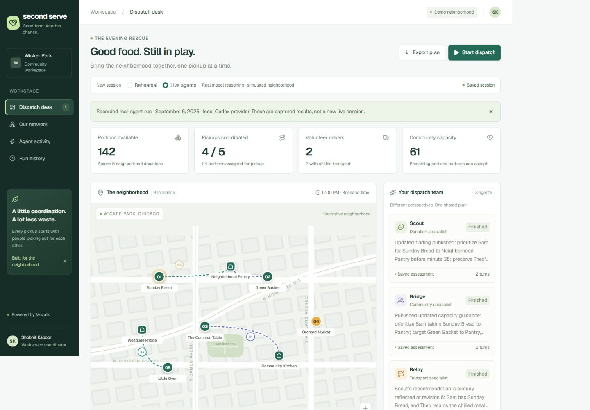

# Second Serve

**Good food. Another chance.**

An evening's surplus food is useful only if somebody can collect it in time and take it somewhere that can accept it. Second Serve is a working dispatch prototype for that coordination problem. Three Mozaik agents assess donations, community capacity, and transport together. A coordinator can interrupt the plan by removing a driver, adding a late donation, or advancing the pickup clock.

The point of the demo is the interruption. A model can finish reasoning against a board that has already changed. Second Serve validates every reservation against the current board, rejects stale decisions, and lets the team revise the plan.

Built by **Shobhit Kapoor**, solo, for the September 2026 JigJoy/Mozaik hackathon. AI-assisted development is disclosed; the application performs real model inference in live mode. Neighborhood organizations, addresses, food quantities, travel times, and volunteers are illustrative fixtures. No food is collected, no partner is contacted, and no delivery is claimed.



## Try the important part

1. Open the dispatch desk and choose **Start dispatch**. Without a provider key, the app offers clearly labeled **Rehearsal** mode.
2. As reservations appear, choose **Maya cancels** (or another assigned driver). Watch the assignments change.
3. Open **Agent activity** for the actual request intervals, shared findings, rejected reservations, and revised decisions.
4. Choose **Finish & save**, then open **Run history**. Export the complete record as JSON.

You can also choose **Review real-agent run** on a fresh desk. This opens an unedited captured run from the local Codex provider, explicitly labeled as recorded evidence. It does not make a new inference request.

## What is implemented

- A responsive dispatch desk, functional neighborhood map, donation details, partner capacity view, driver controls, agent timeline, and saved run history.
- Three independent agents using `@mozaik-ai/core` **4.0.6**: Scout (donations), Bridge (recipients), and Relay (dispatch).
- Event-driven updates through Mozaik situation handlers; independent inference can overlap while each agent maintains its own conversation.
- Atomic reservation validation: board revision, donation uniqueness, driver availability, chilled transport, total shift weight, recipient categories/capacity, and cumulative pickup timing.
- A real server backend with streamed server-sent events, a durable D1 command queue and run history, per-session ownership, same-origin mutation checks, bounded requests, and provider timeouts.
- A provider-backed inference runner, an explicitly simulated rehearsal runner, and an optional local Codex CLI bridge. Credentials remain server-side.

## Run locally

Use Node.js 22.13 or newer and npm. From this directory:

```sh
npm ci
npm run db:local
npm run dev
```

Open the URL printed by the server (normally `http://localhost:3000`). The first request creates an anonymous workspace session. History belongs to that browser session; clearing its cookie removes access to its saved runs.

For real API inference, copy `.env.example` to `.env`, set `OPENAI_API_KEY` and `OPENAI_MODEL`, and restart the server. The default endpoint is OpenAI's Chat Completions API; `OPENAI_BASE_URL` can point to a compatible server. The application does not claim that every provider is compatible. Tool calling is required. Do not use a `VITE_` prefix for secrets.

The public fixture can be explored without credentials. **Rehearsal is not evidence of LLM performance.**

For Gemini, set `GEMINI_API_KEY` and `GEMINI_MODEL` instead. This selects Google's fixed OpenAI-compatible endpoint; the Gemini credential takes precedence over `OPENAI_API_KEY`. The adapter preserves opaque tool-call signatures in server memory and rejects incomplete or unsupported actions. Check the project's actual rate limits in AI Studio before exposing live mode to reviewers. Compatibility tests exercise the transport contract; a working key and a successful live integration run are still required to verify provider access.

### Optional: existing local Codex sign-in

If you already use the Codex CLI, the local bridge can run real inference without exporting its account credentials. This is a development tool, bound to `127.0.0.1`; never publish, tunnel publicly, or deploy it as a shared inference service.

1. Verify `codex login status` in your own terminal.
2. Set `LOCAL_PROVIDER_TOKEN` to a random string of at least 24 characters in an ignored `.env.bridge` file. Set `OPENAI_API_KEY` to the same local token, `OPENAI_BASE_URL=http://127.0.0.1:4318/v1`, and `OPENAI_MODEL=codex-local-default` in that file.
3. Run `node --env-file=.env.bridge scripts/local-codex-provider.mjs`. `CODEX_EXECUTABLE` can specify the installed CLI path.
4. In another terminal, run `node --env-file=.env.bridge --import tsx scripts/prove-live.ts` to collect a new real-agent run.
5. To use it through the local web app, put the three `OPENAI_` values in `.env` and restart the development server.

The bridge invokes documented `codex exec` structured output in an ephemeral, read-only temporary workspace. It asks for one application decision at a time; Second Serve executes only its own validated tools. It uses the CLI's default model, recorded as `codex-local-default`, rather than assuming a model identity. Each inference consumes the signed-in account's usage. [Codex non-interactive documentation](https://developers.openai.com/codex/noninteractive/)

## Verify

```sh
npm run typecheck
npm run lint
npm test
npm run build
npm run check:api
```

The last command needs the development server and initialized D1 database. Set `DISPATCH_LIVE=1` to exercise the configured model provider through the same streaming HTTP API. Set `DISPATCH_URL` to change the server URL. It checks cancellation, durable retrieval, ownership isolation, and cross-origin rejection. It writes the observed record into `evidence/`.

The tests check actual constraints and runtime behavior, including a stale board and cancellation during overlapping inference. Lint covers application code; generated UI primitives are excluded. One documented React Compiler internal-error diagnostic is suppressed for the async stream parser, while TypeScript and hook rules remain enabled.

## Evidence, not claims

The committed [`evidence/live-local-codex-run.json`](evidence/live-local-codex-run.json) records a real local run on September 6, 2026:

| Observation | Recorded value |
| --- | ---: |
| Peak overlapping model requests | 3 |
| Completed requests | 17 |
| Shared specialist findings | 4 |
| Stale reservations rejected | 1 |
| Final feasible pickups | 4 |
| Portions in the final plan | 114 of 142 |

These are observations from one scenario, not a speed benchmark, optimality proof, or real-world impact measurement. The frontend's bundled copy is identical to that record. See [`docs/EVIDENCE.md`](docs/EVIDENCE.md) for provenance and the distinction between the recorded real run and deterministic rehearsal.

## Deployment and limits

The application builds to a Cloudflare-compatible Worker and uses one D1 binding, `DB`. Drizzle migrations live in `drizzle/`. Sites deployment uses `.openai/hosting.json`; a separate deployment should create its own project rather than reuse this project's identifier. Runtime secrets belong in the hosting environment, not the manifest or source archive.

Each session runs for up to four minutes, with a maximum of 48 inference requests including retries. Gemini sessions admit at most 12 requests in a rolling minute per run, allowing independent calls to overlap. Quota waiting is excluded from inference spans. This pacing is per run; concurrent sessions and other apps still share the provider's account quota. Temporary service errors and quota responses receive at most two retries, while malformed actions and authentication failures stop the affected turn. Failed requests remain in the trace.

Some providers return multiple tool calls despite the single-call preference. The adapter drains those through Mozaik's individual tool transitions and preserves the original response grouping and opaque signatures for the next provider request. Every reservation still passes the current-board validation gate; queued tool execution does not count as additional model inference.

The demo limits new sessions per browser and globally per hour. These limits are abuse deterrents, not a billing guarantee. Active orchestration is request-scoped; an interrupted connection stops the session, and the last persisted snapshot remains available. It does not automatically resume in-flight model work after a Worker restart.

Routes use an illustrative distance estimate rather than a traffic service. Driver capacity is conservatively reserved across the entire shift; the system does not optimize loading/unloading dynamics. Reservations require human review. Real operations would need partner onboarding, inventory and food-safety checks, verified travel estimates, delivery confirmation, stronger identity, and durable orchestration across disconnects.

See [`docs/ARCHITECTURE.md`](docs/ARCHITECTURE.md), [`docs/DEMO.md`](docs/DEMO.md), and [`docs/SUBMISSION.md`](docs/SUBMISSION.md).
The completed checks and browser observations are recorded in [`docs/VALIDATION.md`](docs/VALIDATION.md).

## License and credits

MIT. The runtime is Mozaik; the app uses React, Vinext, Cloudflare Workers/D1, Drizzle, Tailwind, Base UI/Shadcn primitives, Lucide icons, and Geist fonts. Existing packages and generated primitives are distinguished from project-specific work in [`docs/BUILD_LOG.md`](docs/BUILD_LOG.md).

