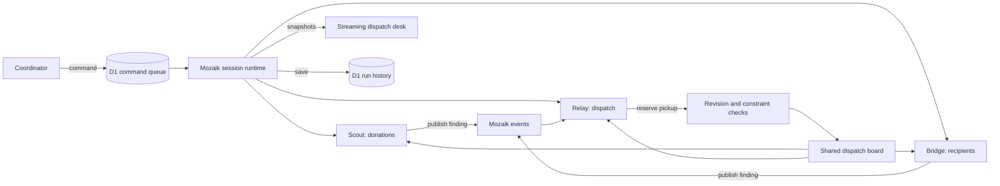

# How Second Serve coordinates

## Three specialists, one changing board

`lib/dispatch-engine.ts` creates a Mozaik runtime for each run, initializes a typed `RuntimeState`, joins one human coordinator and three agents, and starts independent `runLoop` calls. `runLoop` is fire-and-forget in the pinned SDK. Starting Scout does not await Scout before starting Bridge or Relay.

Scout assesses closing windows and transport requirements. Bridge assesses which community partners can accept the food. Relay makes reservations. The two specialists publish findings through a tool, and that tool emits a Mozaik semantic event. Relay's situation handler schedules a new assessment from that finding. Coordinator commands also emit events to all three agents.

Each agent has at most one active loop. If another event arrives during that loop, the pending reason is coalesced and assessed after the loop settles. The current board and recent findings are supplied then, so coalescing does not lose the actual state change. Separate agents continue concurrently. This prevents two overlapping loops from corrupting the same agent's conversation.

The activity view reports request start/end intervals, not chain-of-thought. Public explanations come from the agents' findings, tool arguments, final summaries, and observable validation results.

## The stale-decision boundary

The reservation tool receives `expectedRevision`. `reserve()` compares it to the current board immediately before applying the mutation. It has no `await` between validation and mutation, so that check-and-write is atomic inside the session's JavaScript isolate.

It then checks feasibility from authoritative state: one reservation per donation; driver availability and refrigeration; cumulative reserved weight; recipient acceptance and capacity; and estimated arrival before closing. A model cannot override these checks through its explanation. A stale or infeasible proposal returns a rejection plus the current revision and fresh candidates.

Only Relay writes reservations. Optimistic revisions protect against concurrent coordinator changes; we do not claim this is a multi-Worker distributed transaction. Each independent run owns its own board and record. The D1 command queue transfers coordinator updates into that board.

The available candidates are deterministic calculations. They assist the model and enforce constraints; they do not impersonate an AI agent. Real model calls choose actions and explanations in live mode. The deterministic rehearsal runner follows a fixed strategy and is always labeled separately.

## Request and persistence path

`POST /api/runs/start` creates a run, persists it, and returns server-sent events while the runtime works. A bounded loop drains queued commands, persists snapshots, and sends heartbeats. `POST /api/runs/:id/commands` validates and queues a change. Commands have unique IDs, and the engine also deduplicates processed IDs.

`GET /api/runs` and `GET /api/runs/:id` read only the current browser session's rows. SQL uses bound parameters. The cookie is HttpOnly and SameSite=Lax, and Secure on HTTPS. Mutations reject an Origin that differs from the request origin. All scenario content is rendered as text by React. Provider credentials are read only by the server and are absent from event records.

Saving snapshots is periodic, not a claim of transactional persistence after every displayed event. If the connection or Worker fails, up to the most recent save interval may be lost. The app preserves the latest saved record; it cannot automatically resurrect active inference.

## Failure handling

- Provider calls have a timeout. Failures settle the Mozaik loop with an explicit error so a fire-and-forget rejection cannot crash the process.
- Completed reservations remain reviewable after an inference error.
- Finish prevents subsequent tool mutations; in-flight requests are allowed a bounded settling period.
- Session duration, inference count, and hourly starts are bounded.
- D1 reads and writes use per-run ownership. No user can enumerate another browser's private runs through the public history routes.
- Public captured evidence contains only the built-in scenario and agent output, never cookies, authentication, or provider keys.

The local Codex bridge is optional development infrastructure. It is not shipped inside the Worker and is not a public service. The hosted live runner expects a server-configured compatible provider.

## File map

| File | Responsibility |
| --- | --- |
| `lib/domain.ts` | Scenario, feasibility, reservations, commands, metrics |
| `lib/dispatch-engine.ts` | Mozaik participants, events, scheduling, trace |
| `lib/inference.ts` | Real provider transport and labeled rehearsal |
| `lib/server/store.ts` | D1 queries, ownership, command queue, limits |
| `app/api/` | Session, stream, commands, history endpoints |
| `hooks/use-dispatch.ts` | Client stream consumption and actions |
| `components/dispatch-desk.tsx` | Main working interface |
| `components/operations-panels.tsx` | Network, timeline, history, details |
| `scripts/prove-live.ts` | Real inference overlap and recovery check |
| `scripts/check-api.mjs` | End-to-end API and persistence check |

